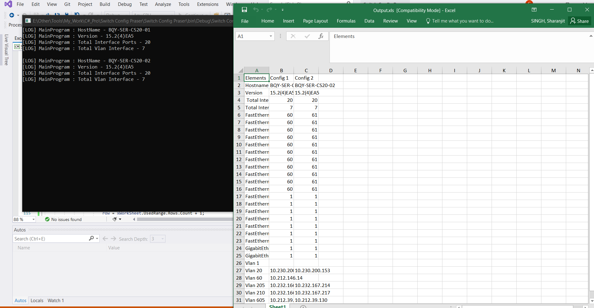

# Cisco Switch Configuration Praser

Configuration praser tool scans through the switch configuration files and extract VLANs, Interfaces assoiste with VLANs, Switch name, software version etc. and the output to the excel file. This tool scans multiple configuration files at once and creates comparison excel file.

## Currently supported Elements
* Hostname
* Version
* Total Interface Ports
* Total Interface VLANs
* Interface ports/VLANs IP address

## How to use

* Open the project in Visual Studio
* Add the list of configuration file location as per below sample under "MainWindow.xaml.cs"
'''
        private void getConfigFiles()
        {
            configFiles[0] = @"D:\S07_SWT_101";
            configFiles[1] = @"D:\S07_SWT_102";
            configFiles[2] = @"D:\d01-stcswt-101-confg";
            configFiles[3] = @"D:\d01-stcswt-102-confg";
            configFiles[4] = @"D:\d01-stcswt-103-confg";
        }
'''
* Change the output file under MainWindow.xaml
'''
xWorkBook.SaveAs(@"Enter path to where you want to save file along with file name.xls.", Excel.XlFileFormat.xlWorkbookNormal, misValue, misValue, misValue, misValue, Excel.XlSaveAsAccessMode.xlExclusive, misValue, misValue, misValue, misValue, misValue);
'''
## Screenshot of output file

